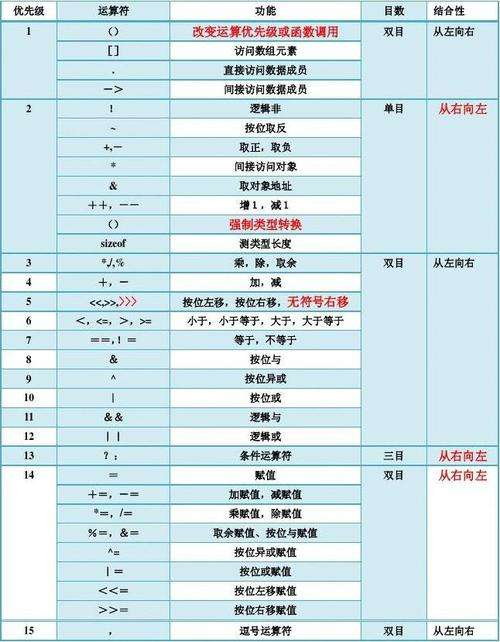

[TOC]

# C语言知识 {ignore=true}

## 1.计算机基础

### 1. 系统位数

位数分别为16、32、64最基本原理是从硬件来讲的。 从CPU的发展史来看，从以前的8位到现在的64位，8位也就是CPU在一个时钟周期内可并行处理8位二进字符0或是1，那么16就以此类推是16位二进制.32位就是32位二进制。64位就64位二进制。因为电脑是软硬相配合才能发挥最佳性能的。所以操作系统也必须从32位的到64位的，这样才能发挥出最佳的性能。

## 2. 关键字和运算符

### 1.   static

- c语言中，static用来说明静态变量。
- 如果是在函数外面定义的，那么其效果和全局变量类似，即static说明的变量可以在当前c程序文件中使用。
- 如果是在函数内部定义的，那么这个变量只初始化一次，即使再次调用这个函数，这个static变量也不会再次被初始化，于是，这个变量的取值就会一直保存着，我们再次调用该函数时，仍是保存的上一次函数调用时保存的结果。

**举例说明**

```C
static int a;
int b;
void func(void)
{
    static int c;
    int d;
}
```

上面程序中，a与b都是全局变量，二者的区别是，b可以被别的文件使用，a只能在本文件中使用，这是static对全局变量的作用。
c和d的区别是，d是一个自动变量，func函数执行完后，d会自动被释放。但c却不会被释放，下一次调用func函数时，c的值会保留上次的值继续使用。

### 2. new

- C++中可以使用new在运行阶段分配内存
- 动态分配内存的格式：

``` C++
int * pn = new int; 
typeName * point_name = new typeName;
```

- new运算符返回该内存的地址
- 数据对象指的是为数据项分配的内存块。
- 动态分配内存使程序在管理内存方面有更大的控制权。
- new分配的内存块通常与常规变量声明分配的内存块不同。变量的值都存储在栈内存(stack)区域中;而new运算符从堆 (heap)或自由存储区 (free store)的内存区域分配内存。
  
### 3. delete

- delete 运算符可以在使用完内存后，将内存归还给内存池。归还或释放的内存可供程序的其他部分使用。
- 使用delete 时，后面要加上指向内存块的指针变量(内存块是由new分配)∶

```C++
  int * ps = new int;
delete ps;
```

> 注意:
>
> - 一定要配对地使用new和 delete，否则会发生内存泄漏(memory leak) ;
> - 不要释放已经释放的内存块;
> - 不能使用delete 来释放声明变量所获得的内存;
> - delete释放的是内存，不会删除变量本身，变量仍可获得另一个新分配的内存块

### 4. sizeof

- 对数组名进行 sizeof，获取的是数组的字节大小，sizeof(testArray[0]) 是获取第一个元素的字节大小

## 3. 运算符

### 1. 运算符的优先级和结合性




1. 结合方向只有三个是从右往左，其余都是从左往右。
2. 所有双目运算符中只有赋值运算符的结合方向是从右往左。
3. 另外两个从右往左结合的运算符也很好记，因为它们很特殊：一个是单目运算符，一个是三目运算符。
4. C语言中有且只有一个三目运算符。
5. 逗号运算符的优先级最低，要记住。
6. 此外要记住，对于优先级：算术运算符 > 关系运算符 > 逻辑运算符 > 赋值运算符。逻辑运算符中“逻辑非 !”除外。

### 2. printf函数常用格式字符串和附加格式字符

#### 1. 格式字符串

| 类型   | 格式字符串 | 输出形式                                               |
|--------|------------|--------------------------------------------------------|
| 整型   | %d         | 带符号的十进制形式（正数不输出符号+）                  |
| 整型   | %o         | 无符号的八进制形式（不输出前导符号0）                  |
| 整型   | %x或%X     | 无符号的十六进制形式（不输出前导符号0x或0X             |
| 整型   | %u         | 无符号的十进制形式                                     |
| 实型   | %f         | 小数形式，默认小数位数为6位                            |
| 实型   | %e或%E     | 指数形式，数字部分默认为6位                            |
| 实型   | %g或%G     | 优化的小数或指数形式（去掉无意义的0后所占宽度较少的1种 |
| 字符型 | %c         | 单个字符形式（不输出单引号’）                         |
| 字符型 | %s         | 字符串（不输出双引号”）                               |

#### 2. 常用附加格式字符

| 字符 | 功能                                                   | 示例     |
|------|--------------------------------------------------------|----------|
| m    | 输出数据域宽，当数据长度< m时，左补空格，否则按实际输出 | %8d      |
| n    | 对实数，指定小数点后位数（四舍五入）                   | %.3f     |
| n    | 对字符串，指定实际输出位数                             | %.6s     |
| -    | 输出数据在域内时左对齐（缺省时右对齐）                 | %-8d     |
| +    | 指定在有符号数的正数前显示正号（+）                    | %+8d     |
| 0    | 输出数值时指定左面不使用的空位置自动填0                | %08d     |
| #    | 在八进制和十六进制前显示前导0，0x                      | %#o和%#x |
| l    | 在d,o,x,u前，指定输出精度为long型                      | %ld      |
| l    | 在e,f,g前，指定输出精度为double型                      | %lf      |
> 注：上表中m和n均为正整数

## 4. 指针

### 1. 结构体指针

- ->只用于结构体指针访问成员；
  .点只用于结构体名访问成员；

### 2. 函数指针

1. **定义**：如果在程序中定义了一个函数，那么在编译时系统就会为这个函数代码分配一段存储空间，这段存储空间的首地址称为这个函数的地址。而且函数名表示的就是这个地址。既然是地址我们就可以定义一个指针变量来存放，这个指针变量就叫作函数指针变量，简称函数指针。

2. 函数指针的定义方式为：

  函数返回值类型 (* 指针变量名) (函数参数列表);
  例如：` int(*p)(int, int); `

3. 如何用函数指针调用函数

```C++
  int Func(int x);   /*声明一个函数*/
  int (*p) (int x);  /*定义一个函数指针*/
  p = Func;          /*将Func函数的首地址赋给指针变量p*/
  ...
  int a = (*p) (1);
  ...
```

### 3. 指针初始化

## 5. 函数

### 1. scanf

- scanf 函数中的格式控制字符串是为了输入数据用的，无论其中有什么字符，也不会输出到屏幕上；
- scanf() 的格式控制串可以使用其他非空白字符，如逗号，但在输入时必须输入这些字符，以保证匹配就可以。

> **scanf, gets, getchar**
>
> - gets是得到一整行的字符串, 可以接收空格;
> - getchar是得到一个字符；
> - scanf("%s")是得到一个连续的字符串，遇到空格、回车、Tab键会自动终止；

### 2. malloc

函数原型：

```C
 void *malloc(unsigned int num_bytes); 
```

**说明：**该函数只有1个参数，就是要分配内存的总字节数。分配完毕后，不会自动初始化。

### 3. calloc

函数原型：

```C
void *calloc(unsigned n, unsigned size)l;
```

**说明：**该函数有2个参数，第1个参数是需要分配多少个这种数据类型的数据，第二个参数是需要分配的数据类型所占的字节数。分配完成后，被分配的数据被自动初始化成该数据类型的缺省值，数值型为0，字符型为'\0'。
>
> - malloc和calloc函数在头文件stdib.h中，使用时需要用预处理指令将这个头文件包括进来
> - 用malloc()和calloc()函数完成内存分配后，这两个函数都会返回一个void *类型的指针，这个指针所指的位置就是刚刚分配的内存的首地址。

### 4. free

函数原型：

```C
void free(void *FirstBytes);
```

## 6. 数组

### 1. 与二维数组相关的地址表示形式

| 表示形式                           | 含义                  | 地址值      |
|------------------------------------|-----------------------|-------------|
| &a                                 | 指向二维数组的指针    | 2000        |
| a                                  | 二维数组名，第0行地址 | 2000        |
| a[0],\*(a+0),\*a                   | 第0行第0列地址        | 2000        |
| a+1,&a[1]                          | 第1行首地址           | 2008        |
| a[1],\*(a+1)                       | 第1行第0列元素地址    | 2008        |
| a[1]+1,\*(a+1)+1,&a\[1]\[1]        | 第1行第1列元素地址    | 2012        |
| \*(a[1]+1),\*(\*(a+1)+1),a\[1]\[1] | 第1行第1列元素的值    | 元素值为... |
